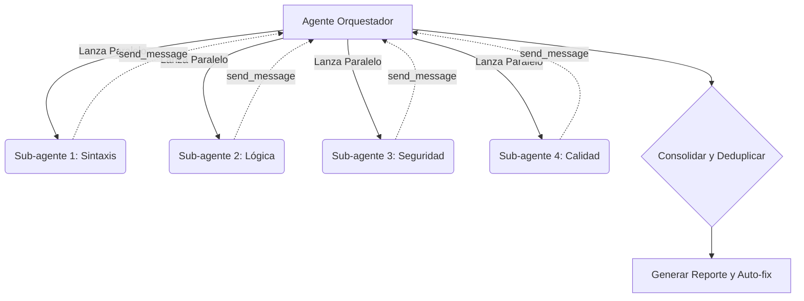

# Revisión de Código Recursiva (Recursive Code Review)

Esta habilidad implementa un sistema automatizado de revisión de código en 4 pasadas, diseñado para el proyecto PicTik. Utiliza paralelización de sub-agentes para analizar sintaxis, lógica, seguridad y calidad de forma concurrente, asegurando que el código entregado sea robusto, seguro y mantenible.

## Algoritmo de Revisión Recursiva en 4 Pasadas

El proceso de revisión se estructura como un pipeline donde cada "pasada" (pass) puede ejecutarse como un sub-agente en paralelo. El orquestador consolida los hallazgos.

### Pasada 1: Sintáctica y Compilación

En esta pasada se asegura que el código sea estructuralmente válido y cumpla con las reglas básicas del lenguaje y el framework.

- **Compilación TypeScript:** Ejecutar `pnpm check` (`tsc --noEmit`). Todo el código debe compilar sin errores en modo estricto.
- **ESLint y Formateo:** Validar el código usando ESLint (incluyendo plugins de seguridad y React Hooks) y verificar el formateo con Prettier.
- **Resolución de Importaciones:** Detectar y prevenir dependencias circulares.
- **Verificación de Build:** Ejecutar `pnpm build`. El cliente (Vite) y el servidor (esbuild) deben compilar exitosamente en la carpeta `dist/`.
- **Validación de Esquemas Drizzle:** Asegurar que los esquemas de base de datos de Drizzle (users, galleries, photos, etc.) estén bien definidos y exportados.
- **Código Muerto Básico:** Identificar y reportar importaciones, variables y exportaciones no utilizadas.
- **Consistencia Zod:** Verificar que los esquemas de Zod se mantengan consistentes entre la validación del cliente y del servidor (tRPC).

### Pasada 2: Lógica y Correctitud

Esta pasada se enfoca en el comportamiento dinámico esperado, el manejo del estado y la integridad de los datos.

- **Null Safety:** Verificar posibles accesos a variables nulas o indefinidas (potential null/undefined access).
- **Condiciones de Carrera (Race Conditions):** Analizar la correctitud del uso de `async/await` y el manejo concurrente de Promesas, especialmente en mutaciones tRPC.
- **Casos Borde (Edge Cases):** Validar el comportamiento con arreglos vacíos, valores cero y condiciones de límite.
- **Manejo de Errores:** Prohibir bloques `catch` vacíos. Asegurar la propagación correcta de errores y la generación de logs.
- **Gestión de Estado:** Revisar patrones de actualización de estado en React 19 y prevenir "stale closures" (clausuras obsoletas).
- **Consultas a Base de Datos:** Detectar problemas de consultas N+1 con Drizzle ORM y verificar el uso de transacciones para operaciones multi-tabla (ej. suscripciones y eventos webhook).
- **Lógica de Negocio:** Hacer cumplir los niveles de suscripción de usuarios y los permisos de acceso a galerías de PicTik.
- **tRPC Completeness:** Asegurar que todos los procedimientos (procedures) tRPC tengan validación de entrada y salida completa mediante Zod.
- **Idempotencia de Webhooks:** Verificar la lógica de deduplicación utilizando claves de idempotencia para Rapyd Collect API.

### Pasada 3: Seguridad

Esta pasada interactúa con la habilidad `cybersecurity-gold-standards` para asegurar un perfil de seguridad implacable.

- **OWASP Top 10:** Auditar cada archivo contra las vulnerabilidades comunes de OWASP.
- **Detección de Secretos:** Buscar patrones de expresiones regulares que indiquen llaves codificadas (hardcoded keys), tokens o contraseñas.
- **Validación de Entrada:** Confirmar que todo input de usuario pase estrictamente por Zod antes del procesamiento.
- **Codificación de Salida (Output Encoding):** Prevenir ataques XSS en componentes React (auditar todo uso de `dangerouslySetInnerHTML`).
- **Inyección SQL:** Verificar que todas las consultas a base de datos usen la parametrización nativa de Drizzle; cero interpolación de cadenas.
- **Protección CSRF:** Validar el uso de tokens en operaciones que cambian el estado del sistema.
- **Bypass de Autenticación:** Comprobar la protección de rutas sensibles y procedimientos tRPC (uso de middleware de autenticación).
- **Autorización:** Verificar que los chequeos de propiedad (ownership) de la galería se realicen antes de conceder acceso a los datos.
- **Vulnerabilidades de Dependencias:** Analizar la salida de `pnpm audit` para mitigar dependencias vulnerables.
- **Violaciones CSP:** Identificar y eliminar scripts/estilos en línea que violen los encabezados CSP.
- **Específico de Rapyd:** Validar la firma HMAC de los webhooks y asegurar que no haya llaves secretas expuestas en el cliente.
- **Subida de Archivos (File Upload):** Validar los tipos MIME reales, límites de tamaño (Cloudflare R2) y prevenir *path traversal*.

### Pasada 4: Calidad y Mantenibilidad

Esta pasada asegura que el código permanezca legible y escalable a largo plazo.

- **Complejidad Ciclomática:** Marcar (flag) funciones con una complejidad ciclomática mayor a 10.
- **Duplicación de Código:** Identificar patrones de código repetidos (DRY) mayores a 10 líneas consecutivas.
- **Código Muerto Avanzado:** Detectar rutas de código inalcanzables (unreachable code) y funciones o componentes sin uso.
- **Cobertura de Pruebas (Test Coverage):** Verificar que el código nuevo o refactorizado posea correspondientes pruebas en Vitest.
- **Documentación:** Exigir JSDoc/TSDoc descriptivos para funciones públicas, contratos tRPC y esquemas complejos.
- **Tamaño de Archivo:** Marcar para refactorización archivos que superen las 300 líneas de código.
- **Tamaño de Función:** Marcar funciones individuales que excedan las 30 líneas de lógica pura.
- **Convenciones de Nombres:** Mantener la consistencia estricta en el nombrado: `camelCase` (variables, funciones), `PascalCase` (Componentes, Tipos, Interfaces) y `SCREAMING_SNAKE` (constantes globales).
- **Auditoría de TODO/FIXME/HACK:** Cada anotación de deuda técnica DEBE hacer referencia a un ticket o issue en el rastreador del proyecto.
- **Accesibilidad (a11y):** Asegurar atributos ARIA correctos en los componentes Radix/Shadcn y validar la navegación por teclado.

---

## Formato de Reporte Estandarizado

El agente orquestador debe producir y mantener un reporte centralizado usando exactamente este formato Markdown:

```markdown
## Reporte de Revisión de Código
### Resumen
- Archivos revisados: [N]
- Hallazgos: [N] (C critical, H high, M medium, L low, I info)

### Hallazgos
| # | Severidad | Pasada | Archivo | Línea | Descripción | Remediación |
|---|-----------|--------|---------|-------|-------------|-------------|
| 1 | CRITICAL  | 3      | auth.ts | 45    | ...         | ...         |
```

### Niveles de Severidad

- **CRITICAL:** Bloquea el despliegue de inmediato. (ej. inyección SQL, bypass de auth).
- **HIGH:** Debe ser arreglado antes del merge. (ej. errores lógicos graves, test que fallan).
- **MEDIUM:** Debería ser arreglado en este ciclo de desarrollo. (ej. mal manejo de estado, deudas técnicas grandes).
- **LOW:** Bueno de arreglar (nice to fix). (ej. estilo inconsistente menor, optimizaciones pequeñas).
- **INFO:** Sugerencias y mejoras estructurales opcionales.

---

## Paralelización con Sub-agentes

Para maximizar la eficiencia temporal, este algoritmo aprovecha la capacidad de paralelización del agente:

1. **Despliegue de Sub-agentes:** Cada una de las 4 pasadas puede instanciarse como un sub-agente independiente ejecutando su contexto aislado.
2. **Orquestación:** Un agente principal (Orquestador) lanza los sub-agentes simultáneamente sobre el mismo árbol de código de la rama actual (git).
3. **Consolidación:** El orquestador recolecta los resultados a través del sistema de mensajería (`send_message`).
4. **Deduplicación:** Se realiza un merge y deduplicación de hallazgos.
5. **Evaluación Cruzada:** La evaluación final de severidad considera las implicaciones entre pasadas (ej. un hallazgo MEDIUM en Calidad puede volverse HIGH si amplifica un riesgo de Seguridad).

### Flujo de Orquestación



---

## Capacidades de Auto-fix

El agente principal tiene permiso para aplicar correcciones automáticas (auto-fix) exclusivamente bajo las siguientes reglas estandarizadas:

**Permitido Auto-fixear:**
### Auto-fix Capabilities
Define which issues can be auto-fixed:
- Formatting (Prettier): auto-fix
- Unused imports: auto-fix
- Missing return types: auto-fix
- ESLint auto-fixable rules: auto-fix
- Security issues: NEVER auto-fix (require human review)
- Logic issues: NEVER auto-fix
- Null/Undefined handling: NEVER auto-fix with `?.` (optional chaining blindly applied causes silent failures). Must be fixed at Zod boundaries or explicit validation.

**PROHIBIDO Auto-fixear (Requieren Revisión Humana o Plan Detallado):**
- **NUNCA** auto-fixear issues detectados en la Pasada 3 (Seguridad). Estos siempre requieren escalamiento y revisión humana.
- **NUNCA** auto-fixear defectos estructurales detectados en la Pasada 2 (Lógica) que involucren consultas de base de datos o lógica de pagos.

---

## Integración con Herramientas (Tooling)

El orquestador debe usar los comandos y análisis disponibles en el ecosistema PicTik:
- **ESLint:** Plugins `@typescript-eslint`, `eslint-plugin-security`, `eslint-plugin-react-hooks`.
- **Prettier:** Para formato consistente.
- **TypeScript:** Modo estricto, uso de `tsc --noEmit`.
- **Vitest:** Ejecución de pruebas y reporte de cobertura (30/30 pasando actualmente).
- **pnpm audit:** Para control de vulnerabilidades de dependencias.
- **Semgrep/SonarQube (Opcional):** Si el entorno lo provee, para matching de patrones de seguridad, complejidad y duplicación.

---

## Checklists de Validación

### Checklist Pre-commit

Antes de que un agente o desarrollador confirme (commit) cambios localmente, ejecutar:
1. `pnpm check` pasa (Cero errores TS).
2. `pnpm test` pasa (Vitest verde).
3. `pnpm build` compila exitosamente Vite y servidor.
4. Cero secretos expuestos en el diff de git.
5. Cero `console.log` sueltos en código de producción.
6. El mensaje del commit sigue la convención de *Conventional Commits* (ej. `feat:`, `fix:`, `chore:`).

### Checklist Pre-merge

Para revisar un Pull Request o rama de feature lista para la rama principal, verificar:
1. Todo el checklist Pre-commit pasa.
2. **Revisión de 4 Pasadas ejecutada en su totalidad.**
3. Validación de Accesibilidad (a11y) verificada en el UI.
4. Perfilamiento de performance base evaluado.

---

## Revisión Recursiva

La característica principal de esta habilidad es su naturaleza "recursiva". Después de que se aplican correcciones (ya sean manuales o mediante auto-fix), el sistema NO asume correctitud.

El agente debe ejecutar la revisión DE NUEVO (trigger del pipeline completo o parcial según el alcance de los cambios) para asegurar:
- Las correcciones (fixes) no introdujeron nuevas vulnerabilidades o defectos de lógica.
- Los auto-fixes aplicados por ESLint/Prettier no rompieron la funcionalidad existente.
- La suite de pruebas (`pnpm test`) sigue pasando exitosamente con 100% de éxito después de cada alteración.

**Límite de Seguridad:** El agente tiene permitido un máximo de **3 niveles de recursión** automáticos. Si el código sigue presentando hallazgos HIGH o CRITICAL en el 4to ciclo, la automatización se detiene y requiere intervención humana inmediata para prevenir loops infinitos.

---

## Criterios de Salida

La habilidad concluye de forma exitosa y aprueba el código única y exclusivamente cuando:
- Existen **CERO (0)** hallazgos de severidad CRITICAL.
- Existen **CERO (0)** hallazgos de severidad HIGH (o si existen, están documentados y eximidos por un humano autorizado explícitamente).
- Todos los hallazgos MEDIUM poseen un plan de remediación (ticket/issue creado).
- La revisión de 4 pasadas ha concluido sin introducir nuevos errores a nivel recursivo.
- La suite de tests pasa en su totalidad después de aplicar todos los fixes.

---

## Anti-patrones (NUNCA HACER ESTO)

Estas reglas son absolutas y priman sobre cualquier otra instrucción durante una sesión de revisión:

- **NUNCA** auto-fixear issues de seguridad sin revisión humana.
- **NUNCA** ignorar warnings de compilación TypeScript.
- **NUNCA** saltear una pasada "porque el código se ve bien" a simple vista.
- **NUNCA** aprobar código que mantenga hallazgos CRITICAL abiertos.
- **NUNCA** ejecutar más de 3 niveles de recursión (re-análisis tras fixes) sin solicitar intervención humana explícita.
- **NUNCA** desactivar reglas de ESLint en un archivo o línea (`// eslint-disable-next-line`) sin documentar extensamente la razón a nivel de código.
- **NUNCA** marcar un hallazgo como *false positive* en el reporte sin proporcionar la justificación técnica exhaustiva por escrito.
